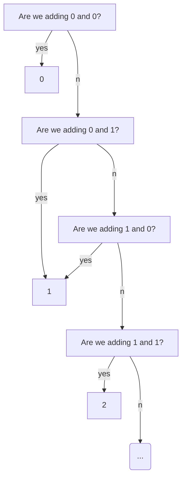

# Rock Unga Bunga

## Transistors

A computer's most basic component is called a [==transistor==](https://en.wikipedia.org/wiki/Transistor) which is made of semiconductors -- materials that conduct electricity *"semi"* of the time. You don't need to understand the specifics of how they work, just that we can use transistors to control the flow of electricity through a wire like a valve controls the flow of water through a pipe.

<figure markdown>
![[transistor.gif]]
<figcaption>gif credit: matc.edu</figcaption>
</figure>

The above gif shows a valve that "opens" when voltage is applied, but we can also make valves that "close" when voltage is applied. Together, these gates can make simple circuits like this:

![[simple logic gate.gif]]

Notice that this kinda looks like a flow chart. By adding more transistors we can model more complex flow charts. Modern CPUs have billions of transistors so if they wanted to they can do stuff like this to perform arithmetic:

Real CPUs don't actually work like this because there are more efficient ways to build a circuit, but the point is that you can do almost any calculation if you throw enough transistors at it.

## Machine Instructions

When we run a program, it gets broken up into individual instructions in RAM and passed to the CPU one by one. This process is called the Von Neumann cycle.

Each instruction is just a line of 1's and 0's that start with an ==op code==. The op code chooses what operation is being done and the rest of the 1's and 0's become the data needed for the operation. For example, if we're adding two numbers, the op code would close all the transistors in our CPU except the ones that lead to the circuit that does addition, and then the rest of the 1's and 0's get interpretted as the numbers being added.

The output might get written to a cache in the CPU so it can be used by the next command or it might send a signal to skip the next 5 instructions, or tell the motherboard to flash the RGB lights on your computer case. It all depends on the actual instruction being run.

## Summary

So computers are made up of transistors that can open and close like valves to control the flow of electricity. An automated process called the Von Neumann cycle loads instructions into the CPU which will trigger it to do something. 